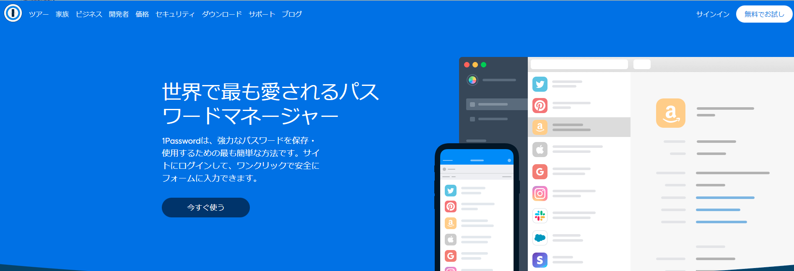
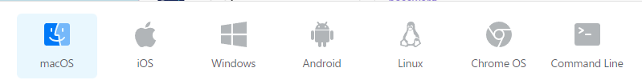

## 1passwordはいいぞ

昨年から自分のパスワード管理やパスワードの生成を全て1Passwordに委ねている。
それが割とセキュアで便利なので啓蒙活動的な。

### 1Passwordって？

パスワードを管理してくれるサブスク
[1Password](https://1password.com/jp/sign-up/)
値段は最低$2.9からで滅茶苦茶安い。
セキュリティ対策とかもバッチリ。

細かいセキュリティ等に関してはとりあえず公式を見てもらうとして、自分的に使いやすい所を紹介します。

### 使いやすいところ

#### 1.対応端末がクソ多い

とりあえずこれを見てほしい。

いや対応してるアプリが多すぎる。
何ならAppleWatchも対応しているらしい。
今のところ自分が使っているのは

* MacOS
* Windows
* iOS

くらいです。
基本的になんでも使えるのマジで便利ですね…
あと端末の使用数の制限もないみたいです。最強。

#### 2.基本的に指紋認証も顔認証も対応している

1Passwordはパスワードを入力するときとかアプリ開いてパスワード確認したりするときに認証が必要なんですが、端末固有の認証方法が使えます。
これはスマホ使っている人だと指紋認証とか顔認証使っていると思うんですが、同じ認証使ってパスワード管理できるの便利なんですよね。
ただ、たまにマスターパスワードの入力を求められて面倒な時もありますが、そうでもないと不正利用もあるかと思うのであきらめてはいます。
ちなみにWindowsHelloも使用できるのでWindowsPCでも顔認証ができます。

#### 3.SSHキーも管理できるし、エージェントとしても使える

これマジですごいです。
自分は今までSSHの秘密鍵を生成して公開キーをアクセス先の鯖に置いたりしていたんですが、もう自分の手元に秘密鍵を置かずに1Passwordで認証することにしました。
これをやると何が便利って、新しいPC買って鯖にSSHする設定をしないとなーっていうのが1Password入れているだけで終わるんです。超便利。
この辺のやり方とかそういうのは後日記事にでもしようかなって思います。

### まとめ

マジで語りつくせないくらいいい機能があり、多分まだ使いこなせていないんだろうなと思っています。
でもマジでクソ安いし最強に使いやすいのでお勧めです。
