## 概要

Nuxtで何か作ってみたりとかを最近していますが、実際に公開しようと思うと結構めんどくさいなと思っています。  
面倒くさい理由としては、  

1. 環境構築が面倒
2. コストがかかってしまうのが嫌だ
3. セキュリティとか運用を考えるのが面倒

という要因が主に上げられます。  

これらの面倒くさいをできるだけ軽くして、すぐにアプリケーションを公開できるために、AWS上にNuxt3をサーバーレスで構築できるCloudFormationテンプレートを作ったので備忘録として残そうと思います。  

## この記事で伝えたい事

* アプリケーションの公開の心理的ハードルを下げる
* できるだけコストがかからないサーバーレスアーキテクチャを学ぶ

## 解決したい課題

### 1.環境構築が面倒

アプリを作る際、Dockerで環境を作ってアプリケーションを作成してっていうのはよくやっているので慣れてきたのですが、環境構築は非常に面倒です。  
AWSのインフラを考えて、サービスを立ち上げて、そこにデプロイをしてというのはどうしても億劫です。  
別に自分で使うだけだからと自宅の開発サーバーで立ち上げたままにして、Tailscale等のVPN経由でブラウザからアクセスするなんて言うことはよく自分もやります。  
ただ、これだけでは社内のチームに共有したりサービスを公開することに対して心理的抵抗ができてしまい、作ったものが評価されづらいという事態に陥ります。  
サービスは些細なものでも外部に公開されていたほうがフィードバックをもらいやすかったりアピールにつながるので、なるべく公開されるべきと考えます。  
環境構築という面倒な作業をなるべく楽にして、心理的抵抗を下げる必要があると思います。  

### 2.コストがかかりすぎてしまう

サービスを外部に公開する際には、サーバーを借りてデプロイをするというのは近年だいぶ値段が下がっているので安くなっています。  
例えばAWSでEC2,ALB,CloudFrontを利用して一か月とかであれば3000円程で済むのではないでしょうか？  
ただサーバーが落ちてしまった際や、冗長構成を組もうと考えるとコストは上がっていくと思われます。  
無限に開発費用があるわけではないため、ちょっとしたものを公開するためにはできるだけコストは安いほうが良いと思います。  

### 3.セキュリティとか運用が面倒

サービスを外部に公開する際に真っ先に考えるのはセキュリティです。  
サーバーに対しての攻撃を防いだり、するためにはインフラの知識やWAF,FireWallの知識が必要となります。  
そしてそのセキュリティを維持するため、サーバーのアップデートであったりといった運用が必須となってしまします。  
ちょこっと作ったものを公開するのにそのあとの作業が多く発生するというのは非常に望ましくありません。  

## Nuxt3をサーバーレスでAWS上にCloudFormationも利用して展開する

### 構成

今回作成したAWSの構成は下記となります。  
動的コンテンツはLambda、静的コンテンツはS3で配信します。  
この構成であれば、かなり安価にAWS上でWEBアプリが公開できるんじゃないかなと思います。  

  

### 具体的な構築方法

具体的な構築方法に関しましては下記の技術ブログを参考にしていただければと思います。  

[Nuxt3 CloudFront × Lambda でSSR構成](https://www.fourier.jp/techblog/articles/nuxt3-ssr-cloudfront-lambda/)  
[AWS Lambda + Nuxt3で実現する「サーバーレスなSSR」とその構成](https://serverless.co.jp/blog/512/)  

### CloudFront部分のCloudFormation化

上記の技術ブログではGUIでCloudFrontの構築をしていますが、今回はテンプレート化していろいろなプロジェクトで適用できるようにするのが目的なのでCloudFormationファイルを作成しました。  
CloudFormationにこのテンプレートを入れる際、serverlessでデプロイしたS3バケットの名前とLambdaのURLを入力する必要があります。  

```yml
AWSTemplateFormatVersion: "2010-09-09"
Description: "Create a CloudFront distribution with a Lambda function URL and an S3 bucket as the origin domains."

Parameters:
  LambdaFunctionURL:
    Type: String
    Description: "The URL of the Lambda function.(after https://~)"
  S3BucketName:
    Type: String
    Description: "The name of the S3 bucket."

Resources:
  OriginAccessControl:
    Type: "AWS::CloudFront::OriginAccessControl"
    Properties:
      OriginAccessControlConfig:
        Name: "MyOriginAccessControl"
        Description: "Control access to the S3 bucket"
        OriginAccessControlOriginType: "s3"
        SigningBehavior: "always"
        SigningProtocol: "sigv4"

  CloudFrontDistribution:
    Type: "AWS::CloudFront::Distribution"
    Properties:
      DistributionConfig:
        Enabled: true
        DefaultCacheBehavior:
          TargetOriginId: "LambdaFunctionOrigin"
          ViewerProtocolPolicy: "allow-all"
          ForwardedValues:
            QueryString: false
            Cookies:
              Forward: "none"
          MinTTL: 0
          DefaultTTL: 3600
          MaxTTL: 86400
        Origins:
          - DomainName: !Ref LambdaFunctionURL
            Id: "LambdaFunctionOrigin"
            ConnectionAttempts: 3
            ConnectionTimeout: 10
            CustomOriginConfig:
                HTTPPort: 80
                HTTPSPort: 443
                OriginKeepaliveTimeout: 5
                OriginProtocolPolicy: "https-only"
                OriginReadTimeout: 30
                OriginSSLProtocols:
                  - "TLSv1.2"
          - DomainName:
              Fn::Sub: "${S3BucketName}.s3.amazonaws.com"
            Id: "S3BucketOrigin"
            OriginAccessControlId: !Ref OriginAccessControl
            S3OriginConfig: {}
            ConnectionAttempts: 3
            ConnectionTimeout: 10
        DefaultCacheBehavior:
          AllowedMethods:
            - "HEAD"
            - "GET"
          CachedMethods:
            - "HEAD"
            - "GET"
          Compress: true
          CachePolicyId: "4135ea2d-6df8-44a3-9df3-4b5a84be39ad"
          OriginRequestPolicyId: "b689b0a8-53d0-40ab-baf2-68738e2966ac"
          SmoothStreaming: false
          TargetOriginId: "LambdaFunctionOrigin"
          ViewerProtocolPolicy: "allow-all"
        CacheBehaviors:
          -
            AllowedMethods:
              - "HEAD"
              - "GET"
            Compress: true
            CachePolicyId: "658327ea-f89d-4fab-a63d-7e88639e58f6"
            PathPattern: "/_nuxt/*"
            SmoothStreaming: false
            TargetOriginId: "S3BucketOrigin"
            ViewerProtocolPolicy: "allow-all"
          -
            AllowedMethods:
              - "HEAD"
              - "GET"
            Compress: true
            CachePolicyId: "658327ea-f89d-4fab-a63d-7e88639e58f6"
            PathPattern: "/*.*"
            SmoothStreaming: false
            TargetOriginId: "S3BucketOrigin"
            ViewerProtocolPolicy: "allow-all"

```  

ただこれだけだとS3バケットのバケットポリシーが適用できないので、serverlessで生成されたS3に以下のバケットポリシーに下記を設定します。  

```json
{
    "Version": "2008-10-17",
    "Id": "PolicyForCloudFrontPrivateContent",
    "Statement": [
        {
            "Sid": "AllowCloudFrontServicePrincipal",
            "Effect": "Allow",
            "Principal": {
                "Service": "cloudfront.amazonaws.com"
            },
            "Action": "s3:GetObject",
            "Resource": "arn:aws:s3:::${S3BucketName}/*", //ポリシーを適用するS3バケットの名前を入力する
            "Condition": {
                "StringEquals": {
                    "AWS:SourceArn": "${CloudFrontDistributionArn}" //CFNで作成したCloudFrontDistributionのArnを入力
                }
            }
        }
    ]
}
```

これでCloudFrontから配信が可能になります。  

## 今後やりたい事

今後改良したい部分は以下になります。  

1. GithubActionsを利用したデプロイ
2. S3バケットポリシーといった手動部分を完全に自動デプロイできるようにする。
3. CloudFrontのデプロイを完全にserverlessに移行

## まとめ

まだまだ改善の余地は非常にあるのですが、一旦デプロイに関してはかなり心理的抵抗が減りました。  
今後はこれをさらにブラッシュアップしてテンプレート化を進めることで、より短い時間でデプロイができて、リリースというものが心理的抵抗なく楽にできるように作りこんでいこうと思います。
