## 手元でECRリポジトリを使いたーい

例えば、ECRに自作のイメージを保存しておいて、開発にそのイメージを使いたいときなんかの備忘録  

### ざっとイメージ



### 前提条件

ECRにアクセスができるユーザのアクセスキーとシークレットキーを入手しておく

### 手順

#### 1.ECRにログイン

ECRにログインをする

```shell
aws ecr get-login-password --region ${your_region} | docker login --username AWS --password-stdin ${your_aws_account_id}.dkr.ecr.${your_region}.amazonaws.com
```

> note  
>
> STSをしたりする場合は事前にSTSをしておくこと  
> [STSで一時クレデンシャルを発行する](https://dev.classmethod.jp/articles/sts-temporality-credential/)

#### 2.Dockerfileからイメージを参照する

``` Dockerfile
FROM ${your_aws_account_id}.dkr.ecr.${your_region}.amazonaws.com/testapp:latest
```

## 参考情報

[プライベートレジストリの認証](https://docs.aws.amazon.com/ja_jp/AmazonECR/latest/userguide/registry_auth.html)
