具体的な構築は下記URLを参考に  
[Autoscaling GitLab CI on AWS Fargate](https://docs.gitlab.com/runner/configuration/runner_autoscale_aws_fargate/)  
[How to build containers with the AWS Fargate Custom Executor for GitLab Runner and AWS CodeBuild](https://about.gitlab.com/blog/2020/07/31/aws-fargate-codebuild-build-containers-gitlab-runner/)

## 前提条件

1. 基本的にGitlabやGitlabRunnerはプライベートサブネットに配置する。  
2. GitlabとGitlabRunnerの通信はプライベートIPでのやりとりにする。  
3. DockerBuildができる環境にする  
4. Gitlabにはhttp意外にsshで接続できるように拡張性を持たせておく  
5. できるだけ安くてエコなシステムにする  

## 構成図



## 各セクションの説明

### ユーザ→NLB→Gitlab

1. 要件にGitlabはプライベートサブネットに配置とあるため、前段にNLBを配置してプライベートサブネットでもユーザがアクセスできるようにしている。  
2. 要件にGitlabへのアクセスをsshでもできるようにしないといけないとあるため、NLBでssh通信もできるように。

#### IP制限をどこでかけているか

WAFを使ってIP制限をかけたりしたいところだが、今回はSSHの方もIP制限をかけないと行けないため採用ができない。  
そのためGitlabのインスタンスのセキュリティグループで制限をかけている。  

#### Gitlabインスタンス自体へのアクセス

インスタンスへのSSHは許可しているが、SSH先はGitlabのアプリケーションであってインスタンスサーバー内部へのSSHは許可しない。  
そのためインスタンスには鍵情報を設定せず、AWSのコンソールからSSMでしかサーバにアクセスできないようにしている。  

#### バックアップ

バックアップは日時で出力してS3格納している。

### Gitlab→GitlabRunnerFront→GitlabRunnerCoordinator

処理的には下記のステップを踏む

1. GitlabからJobをFront送る
2. Frontからcoordinatorを立ち上げ、coordinatorでJobを実行
3. Job終了後、coordinatorを終了する

#### Jobの並列数

[こちら](https://docs.gitlab.com/runner/configuration/runner_autoscale_aws_fargate/#step-4-install-and-configure-gitlab-runner-on-the-ec2-instance)のstep.6にあるconfig.tomlのconcurrentを変更することでRunnerのJob並列数が決められる。  
200で設定すれば同時に起動できる起動するFargateが200増える。  
ここの設定数が少ないと、他プロジェクトでJobを動かして制限数に達してしまったせいで動かしたいJobが動かないという現象が起きるため注意  

#### 通信をプライベートIPで

GitlabとGitlabRunnerの通信に関しては、[こちら](https://docs.gitlab.com/runner/configuration/runner_autoscale_aws_fargate/#step-4-install-and-configure-gitlab-runner-on-the-ec2-instance)のstep.5のコマンドのURLをGitlabInstanceのプライベートIPで登録をする。  
config.tomlにclone_urlの項目をrunnersに追加しないと動作しない可能性があるため注意  

```toml
concurrent = 1
check_interval = 0

[session_server]
  session_timeout = 1800

[[runners]]
  name = "fargate-test"
  url = "https://gitlab.com/"
  clone_url = "https://gitlab.com/"
  token = "__REDACTED__"
  executor = "custom"
  builds_dir = "/opt/gitlab-runner/builds"
  cache_dir = "/opt/gitlab-runner/cache"
```

Frontとcoordinatorの通信に関しては、fargate.tomlのEnablePulicIPをFalseにすればプライベートIPで通信できるようになる。  

```toml
LogLevel = "info"
LogFormat = "text"

[Fargate]
  Cluster = "test-cluster"
  Region = "us-east-2"
  Subnet = "subnet-xxxxxx"
  SecurityGroup = "sg-xxxxxxxxxxxxx"
  TaskDefinition = "test-task:1"
  EnablePublicIP = false

[TaskMetadata]
  Directory = "/opt/gitlab-runner/metadata"

[SSH]
  Username = "root"
  Port = 22
```

##### インスタンス等のサイズ

Gitlabは公式の最低要件を満たすようにt2.large  
ただ容量はバックアップが十分にとれるように大きめにすることを推奨  
FrontはJobの振り分けだけなのでt2.micro  
coordinatorはタスク定義で設定になる。  
タスク定義設定の際にFargateSPOTにすると利用料金が安くなる。  
スペックはJobで実行したいことに合わせればいいが、DockerはCodeBuildでやるのでここは考慮しなくてよい（理由は後述）  

##### coordinatorのイメージについて

coordinatorのイメージはlatest運用をしていれば更新は容易。
なんならこのCIに乗せてECRをlatestで更新してあげれば次立ち上がるときには新しいイメージで立ち上がるので機能を追加したいときは非常に気軽に管理運用ができる。

### coordinator → NatGateway

ここに関してはプライベートサブネットからインターネット空間に出ていくという意味もあるが、FargateのパブリックIP固定という意味合いがある。  
デプロイする先でIP制限がかかっている場合、NatGatewayのパブリックIPを許可すればよい(ここはNatInstanceで代用でもよい)  
ただすべてのトラフィックをNatを通してしまうと利用料が跳ね上がるため、VPCEndpointが活用できる部分は活用することをお勧めする。  

### coordinator → S3 & CodeBuild

FargateではDocker in Dockerができないため、Fargate内でDockerBuildはできない。  
そのためソースコード等をjobの中でZIPに固めてS3に配置後、CodeBuildでbuildしECRにpushする必要がある。  

#### CodeBuildの所属

CodeBuildはVPC所属とVPCに所属しない事を選択できる。
今回は無所属を採用

##### 無所属のメリデメ注意点

1. CodeBuildは無所属だとNatとかを通さないで外部通信できるのでDockerBuild時のイメージ等を好きなだけ料金を気にする必要なく使うことができる。  
その代わり、CodeBuildのIPはAWSの共有リソース扱いのためDockerPullしたりする際に無料枠の上限に瞬間で到達する可能性がある。そのため有料会員でloginするか、事前に使用するイメージを固定してECRに登録しておく事をおすすめする。  
1. IPが固定されていないためIP制限がされているレジストリ等にPushはできない。  
他AWS環境のECRにプッシュする場合であれば、AWSアカウントIDでレジストリにpush制限を設けることでCodeBuildからのPushが可能になる。

##### VPC所属のメリデメ注意点

1. 通信はVPCの外部通信に乗っ取るため、Natを使っていればNatを、Firewallを通さなければならなければFirewallを通さなければならなくなる。  
そのためDockerpull等でCloud破産する可能性が高くなる。  
1. CodeBuildにElasticIPを付与することができるようになるので、DockerPullの制限に引っかかることは恐らくそうそうなくなる。はず。  

#### CodeBuildでDockerCache

CodeBuildでは公式でキャッシュを利用できるが、ビルドプロジェクトを複数のGitプロジェクトで共有したりする際には数時間でキャッシュが消えてしまうため活用ができない  
そのためビルド前に使用している最新のイメージタグを取得してpullし、そのイメージをキャッシュとして使用すれば活用ができる。  

#### 公式ドキュメントの補足

[こちらの参考サイト](https://about.gitlab.com/blog/2020/07/31/aws-fargate-codebuild-build-containers-gitlab-runner/#interacting-with-codebuild-through-the-aws-cli)のcodebuild.shだが、改良の余地がある。  
方針としてはこれをそのままコピペして使用すると、Buildが失敗してもスクリプト自体は成功というかたちになってしまうため、CodeBuildのステータスをちゃんと拾ってきて失敗したら強制的にエラーコードを吐かせる必要がある為注意。  

### 料金について

以上で構成はほぼ語り尽くした。  
あとは問題は料金である。  
基本的に常時立っている物はGitlabとFrontのインスタンスとS3に転送しているバックアップやソースコードのみ  
coordinatorやCodeBuildはjobが動いているときだけ立ち上がってそれ以外は料金がかからない  

そのため手入れは多少必要になる可能性があるが、CodePipeline等のAWS機能を全て使うよりかは経済的になっているはずである。

### まとめ

この構成を作るのに時間はかけすぎた気もするが、いろいろな知識や細かい挙動がしれたので結果的に良かったと思われる。  
そうそう壊れるような感じでもないのでほぼメンテナンスフリーで使えそうだし、メンテナンスも楽で良い物ができたなと。  
今後は他にもGitlabCIに関する記事もあげようと思う。
