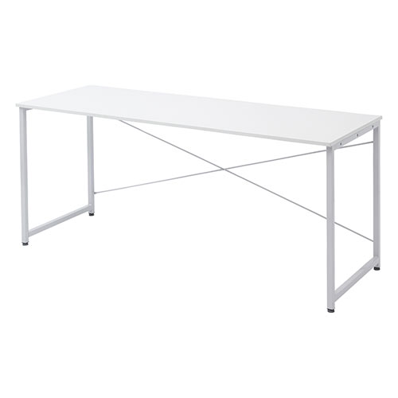
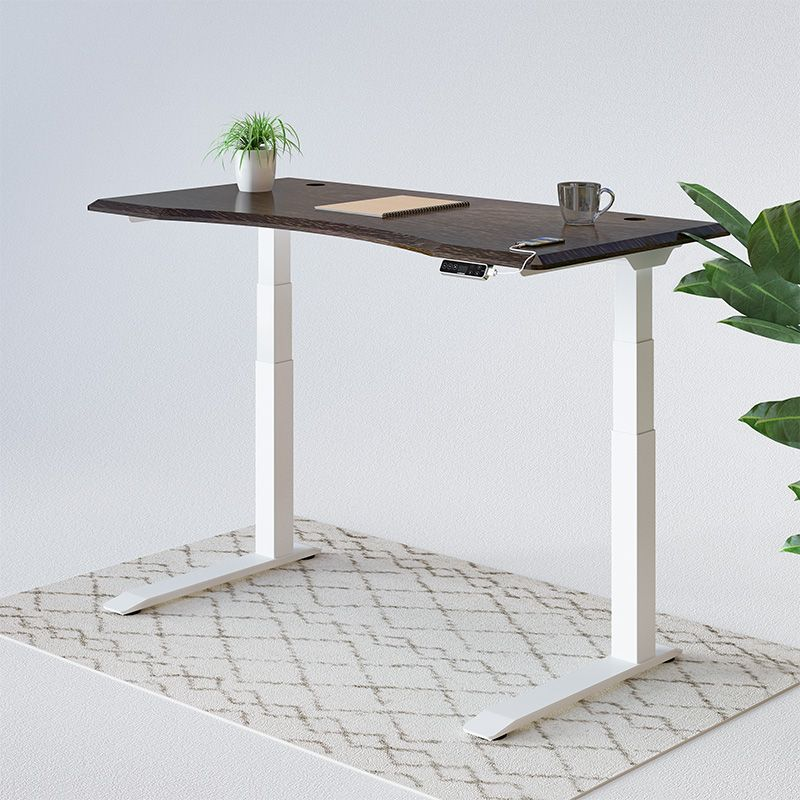
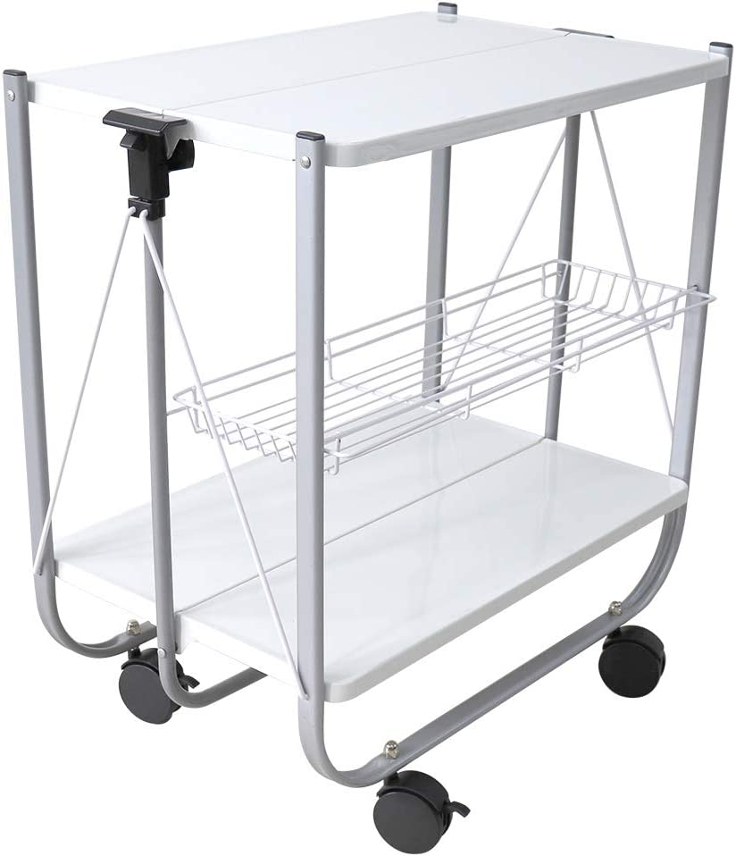

## 目的

友人が引っ越しをするらしいので便利な家具とか家電をいったんまとめてあとで自分が引っ越すときに見直そうという備忘録  

## 家具系

### 机

#### 固定式

##### シンプルワークデスク（デスクダイレクト)

  
[製品リンク](https://desk-direct.com/products/detail.php?product_id=5853)

###### サイズ

幅60 ~ 180cmまである。  
高さは70cm固定。  
奥行きは60と45がある。

###### メリット

横幅と奥行きがいろいろ選べるので部屋にあった物を選べる。  
デザインがシンプルなので他の家具に合わせて統一しやすい。  
モニターアームに対応しやすいように天板裏面のフレームが少し内側に入っており、クランプを使う時にじゃまをしない設計になっている。  
価格も割と安いのでおすすめ  

#### 電動式

##### E7 Pro (FlexiSpot)

  
[製品リンク](https://flexispot.jp/e7-pro.html)

###### サイズ

天板が付け替えれるが、フレームの足の最大調整幅は110 ~ 190cmまで対応している。  
昇降範囲は60 ~ 120cm。
奥行きは天板にもよるが60 ~ 70cm。

###### メリット

天板を自由に選ぶことができる。なんなら公式でなく自分で買っても大丈夫？  
昇降機能が電動なのが良い。手動は力が要るし手軽でないのですぐに使わなくなりそう。  
モニターアームもじゃましない設計になっていて良い  
価格は天板込みだと大体8万程度だが、昔よりは安くなっている印象

### サブの机

##### キッチンワゴン (WEIMALL)

  
[製品リンク](https://amzn.asia/d/dNa9JIw)

###### メリット

折りたたんで冷蔵庫横とか狭いところに置いておける便利なワゴン。  
食事を取るのも全部ここで行っている。  
ちょっとした作業用の机にもなるし、ノートPC置いたりもするし、たまにL字デスクっぽく使いたいときとかにも使っている。  
高さがシンプルワークデスクと同じくらいなので椅子の高さとかいちいち変えて運用とかしなくて良い。  
キャスターで動き回れるから洗濯物をこれで回収して乗せてクローゼットまで運んだりとかもできる。  

### 椅子

#### ゲーミングチェア

##### T3 RUSH (CORSAIR)

  
[製品リンク](https://www.corsair.com/ja/ja/%E3%82%AB%E3%83%86%E3%82%B4%E3%83%AA%E3%83%BC/%E8%A3%BD%E5%93%81/%E3%82%B2%E3%83%BC%E3%83%9F%E3%83%B3%E3%82%B0%E3%83%81%E3%82%A7%E3%82%A2/T3-RUSH-Fabric-Gaming-Chair-(2023)/p/CF-9010058-WW#tab-downloads)

###### メリット

フルリクライニングができる。  
合皮を使っておらず、布素材のためボロボロになる心配がない。（ちょっと毛玉は出る。)  
スチールフレームを使っている部分があり、壊れる心配はあまりなさそう。  
ただ椅子は座ってみないとわからんのでまず座ることをおすすめ  

## まとめ

いったん書き出しました。  
もっと書くものあるけど時間あるときに更新します。  
